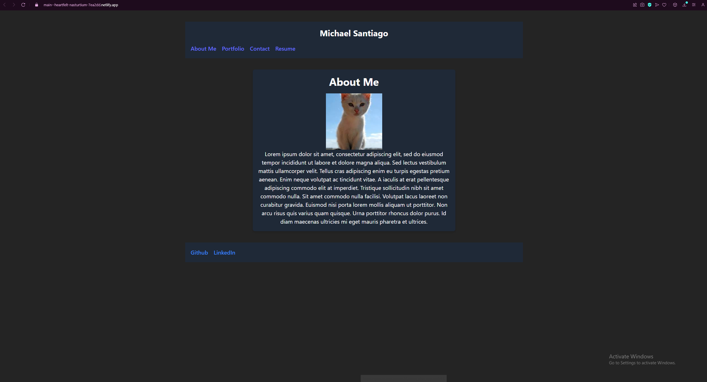

# Personal React Portfolio
    
## Description
    
A well organized page to share my projects with potential employers or with fellow developers to collaborate on future projects.

## Screenshot

    
## Table of Contents
    
- [Installation](#installation)
- [Usage](#usage)
- [License](#license)
- [How to Contribute](#contributing)
- [Test](#test)
- [Questions](#questions)
    
## Installation
    
N/A
    
## Usage
    
You can navigate to the pages using the links in the header and can download my resume by clicking the download resume button in the resume page.
    
## License
    
MIT License
    
## Contributing
    
N/A
    
## Test
    
N/A
    
## Questions
    
My Github account is [GitHub.com/midasantiago](github.com/midasantiago)
    
If you wish to contact me you can do so at mida.santiago98@gmail.com
